# Python REST API Test Application

## 1. Overview

This project provides a sample Python REST API application built with Flask. It is designed to be a starting point for building robust, observable, and secure microservices. The application is containerized with Docker and ready to be deployed to Kubernetes.

The application serves as a simple "context" management service, allowing users to perform CRUD (Create, Read, Update, Delete) operations on context items.

### 1.1. Architecture

The application consists of the following components:

*   **Flask Application:** The core of the application, providing the REST API.
*   **Redis:** Used as a persistent data store for the context items.
*   **Docker:** The application is containerized for portability and ease of deployment.
*   **Kubernetes:** The project includes Kubernetes manifests for deploying the application to a cluster.
*   **Prometheus:** The application exposes a `/metrics` endpoint for Prometheus to scrape.
*   **Datadog:** The application is integrated with Datadog for distributed tracing.

## 2. Project Structure

```
.
├── docker
│   ├── Dockerfile
│   ├── requirements.txt
│   └── src
│       └── app
│           ├── __init__.py
│           ├── business.py
│           ├── health.py
│           ├── main.py
│           ├── templates
│           │   └── index.html
│           └── utils.py
├── docker-compose.yml
├── kubernetes
│   ├── 01-ns-pytbak.yaml
│   ├── 02-svc-pytbak.yaml
│   ├── 03-ing-pytbak.yaml
│   ├── 04-dpl-pytbak.yaml
│   ├── 05-hpa-pytbak.yaml
│   └── 06-istio-pytbak.yaml
└── README.md
```

*   `docker/Dockerfile`: The Dockerfile for building the application image.
*   `docker/requirements.txt`: The Python dependencies.
*   `docker/src/app/`: The Python source code for the application.
    *   `main.py`: The main entry point for the Flask application, containing the API routes.
    *   `business.py`: The business logic for the application.
    *   `health.py`: The health check endpoint.
    *   `utils.py`: Utility functions, such as getting a Redis connection.
    *   `templates/index.html`: The HTML for the main page.
*   `docker-compose.yml`: A file for running the application locally with Docker Compose.
*   `kubernetes/`: Kubernetes manifests for deploying the application.

## 3. Sequence Diagram

The following diagram illustrates the general architectural flow for different types of requests, including interaction with observability components.

```mermaid
sequenceDiagram
    participant Client
    participant Flask App
    participant Auth Module
    participant Business Logic
    participant Redis
    participant External Services
    participant Mgmt Module
    participant Prometheus Metrics
    participant Logging System
    participant DataDog Tracer

    Note over Client, DataDog Tracer: Context Management Flow (with Observability)
    Client->>Flask App: POST /api/contexts
    Flask App->>DataDog Tracer: Start trace span
    Flask App->>Prometheus Metrics: Increment request counter
    Flask App->>Logging System: Log request start
    Flask App->>Business Logic: create_new_context(data)
    Business Logic->>Business Logic: Generate UUID
    Business Logic->>Redis: set(context:id, json_data)
    Redis-->>Business Logic: OK
    Business Logic-->>Flask App: context object
    Flask App->>Logging System: Log successful context creation
    Flask App->>Prometheus Metrics: Record response time
    Flask App->>DataDog Tracer: End trace span
    Flask App-->>Client: 201 Created + context

    Note over Client, DataDog Tracer: Context Retrieval Flow (with Observability)
    Client->>Flask App: GET /api/contexts
    Flask App->>DataDog Tracer: Start trace span
    Flask App->>Prometheus Metrics: Increment request counter
    Flask App->>Business Logic: get_all_contexts()
    Business Logic->>Redis: keys('context:*')
    Redis-->>Business Logic: key list
    loop For each key
        Business Logic->>Redis: get(key)
        Redis-->>Business Logic: json data
    end
    Business Logic-->>Flask App: contexts array
    Flask App->>Prometheus Metrics: Record response time
    Flask App->>DataDog Tracer: End trace span
    Flask App-->>Client: 200 OK + contexts

    Note over Client, DataDog Tracer: Diagnostic Operations (Protected + Monitored)
    Client->>Flask App: GET /api/ping?host=google.com
    Flask App->>DataDog Tracer: Start trace span
    Flask App->>Prometheus Metrics: Increment request counter
    Flask App->>Auth Module: requires_auth decorator
    Auth Module->>Auth Module: check_auth(username, password)
    alt Authentication Success
        Auth Module-->>Flask App: Continue
        Flask App->>Logging System: Log authenticated diagnostic request
        Flask App->>Flask App: subprocess.check_output(['ping', ...])
        Flask App->>Logging System: Log ping command execution
        Flask App->>Prometheus Metrics: Record response time
        Flask App->>DataDog Tracer: End trace span (success)
        Flask App-->>Client: 200 OK + ping output
    else Authentication Failed
        Auth Module->>Logging System: Log authentication failure
        Auth Module->>DataDog Tracer: End trace span (auth failure)
        Auth Module-->>Client: 401 Unauthorized
    end

    Note over Client, DataDog Tracer: Health Check Flow (with Monitoring)
    Client->>Flask App: GET /mgmt/health
    Flask App->>Prometheus Metrics: Increment health check counter
    Flask App->>Mgmt Module: health_check()
    Mgmt Module->>Redis: ping()
    alt Redis Available
        Redis-->>Mgmt Module: PONG
        Mgmt Module->>Logging System: Log healthy Redis connection
        Mgmt Module-->>Flask App: {"status": "UP", "checks": [...]}
        Flask App-->>Client: 200 OK + health status
    else Redis Unavailable
        Redis-->>Mgmt Module: Connection Error
        Mgmt Module->>Logging System: Log Redis connection failure
        Mgmt Module-->>Flask App: {"status": "DOWN", "checks": [...]}
        Flask App-->>Client: 503 Service Unavailable + health status
    end

    Note over Client, Mgmt Module: DNS Resolution (Protected)
    Client->>Flask App: GET /api/dns?name=example.com
    Flask App->>Auth Module: requires_auth decorator
    Auth Module->>Auth Module: check_auth(username, password)
    alt Authentication Success
        Auth Module-->>Flask App: Continue
        Flask App->>Flask App: socket.getaddrinfo(name, ...)
        Flask App-->>Client: 200 OK + IP addresses
    else Authentication Failed
        Auth Module-->>Client: 401 Unauthorized
    end

    Note over Client, DataDog Tracer: External HTTP Request (Protected + Traced)
    Client->>Flask App: GET /api/curl?url=https://example.com
    Flask App->>DataDog Tracer: Start trace span
    Flask App->>Prometheus Metrics: Increment request counter
    Flask App->>Auth Module: requires_auth decorator
    Auth Module->>Auth Module: check_auth(username, password)
    alt Authentication Success
        Auth Module-->>Flask App: Continue
        Flask App->>Logging System: Log external request attempt
        Flask App->>External Services: requests.get(url)
        alt External Request Success
            External Services-->>Flask App: HTTP Response
            Flask App->>Logging System: Log successful external request
            Flask App->>Prometheus Metrics: Record response time
            Flask App->>DataDog Tracer: End trace span (success)
            Flask App-->>Client: Response content
        else External Request Failed
            External Services-->>Flask App: Request Exception
            Flask App->>Logging System: Log external request failure
            Flask App->>DataDog Tracer: End trace span (error)
            Flask App-->>Client: 400 Bad Request + error
        end
    else Authentication Failed
        Auth Module->>Logging System: Log authentication failure
        Auth Module->>DataDog Tracer: End trace span (auth failure)
        Auth Module-->>Client: 401 Unauthorized
    end

    Note over Client, DataDog Tracer: Error Handling and Monitoring
    Client->>Flask App: POST /api/contexts (invalid data)
    Flask App->>DataDog Tracer: Start trace span
    Flask App->>Prometheus Metrics: Increment request counter
    Flask App->>Business Logic: create_new_context(invalid_data)
    Business Logic-->>Flask App: None (validation failed)
    Flask App->>Logging System: Log validation error
    Flask App->>Prometheus Metrics: Increment error counter
    Flask App->>DataDog Tracer: End trace span (validation error)
    Flask App-->>Client: 400 Bad Request + error

    Note over Client, DataDog Tracer: Metrics Export Flow
    Client->>Flask App: GET /metrics
    Flask App->>Prometheus Metrics: Export all metrics
    Prometheus Metrics-->>Flask App: Metrics in Prometheus format
    Flask App-->>Client: 200 OK + metrics data

    Note over Client, DataDog Tracer: Application Info
    Client->>Flask App: GET /mgmt/info
    Flask App->>Mgmt Module: app_info()
    Mgmt Module-->>Flask App: {"app": {...}}
    Flask App-->>Client: 200 OK + app info

    Note over Client, Mgmt Module: Context Update Flow
    Client->>Flask App: PUT /api/contexts/{id}
    Flask App->>Business Logic: update_existing_context(id, data)
    Business Logic->>Redis: exists(context:id)
    Redis-->>Business Logic: true/false
    alt Context Exists
        Business Logic->>Redis: get(context:id)
        Redis-->>Business Logic: json data
        Business Logic->>Business Logic: context.update(data)
        Business Logic->>Redis: set(context:id, updated_json)
        Redis-->>Business Logic: OK
        Business Logic-->>Flask App: updated context
        Flask App-->>Client: 200 OK + updated context
    else Context Not Found
        Business Logic-->>Flask App: None
        Flask App-->>Client: 404 Not Found
    end
```



## 4. Getting Started

### 4.1. Prerequisites

*   [Docker](https://docs.docker.com/get-docker/)
*   [Docker Compose](https://docs.docker.com/compose/install/) (optional, for local development)
*   [kubectl](https://kubernetes.io/docs/tasks/tools/install-kubectl/) (for Kubernetes deployment)

### 4.2. Local Development

To run the application locally for development, you can use Docker Compose. This will start the application and a Redis container.

1.  **Build and start the containers:**

    ```bash
    docker-compose up --build -d
    ```

2.  **Access the application:**

    The application will be available at `http://localhost:5000/api/`.

3.  **View the logs:**

    ```bash
    docker-compose logs -f web
    ```

4.  **Stop the containers:**

    ```bash
    docker-compose down
    ```

### 4.3. Running in Kubernetes

To deploy the application to a Kubernetes cluster:

1.  **Apply the Kubernetes manifests:**

    ```bash
    kubectl apply -f kubernetes/
    ```

2.  **Access the application:**

    You will need to configure an Ingress controller to route traffic to the `pytbak-svc` service in the `pytbak` namespace. Refer to the `kubernetes/03-ing-pytbak.yaml` file for the Ingress configuration.

## 5. API Documentation

The API documentation is split into two sections:

-   **Application API:** Documentation for the main application endpoints is available at `/api/apidocs/`.
-   **Management API:** Documentation for the management and observability endpoints is available at `/mgmt/apidocs/`.

### 5.1. Endpoints

| HTTP Method | URI                | Action                     |
| ----------- | ------------------ | -------------------------- |
| GET         | `/api/contexts`    | Retrieve list of contexts  |
| GET         | `/api/contexts/{id}`| Retrieve a context         |
| POST        | `/api/contexts`    | Create a new context       |
| PUT         | `/api/contexts/{id}`| Update an existing context |
| DELETE      | `/api/contexts/{id}`| Delete a context           |
| GET         | `/api/fib/{n}`     | Calculate Fibonacci number |
| GET         | `/api/sleep/{n}`   | Sleep for n seconds        |
| GET         | `/api/count`       | Increment a counter        |
| GET         | `/api/redisping`   | Ping Redis                 |
| GET         | `/api/ping`           | Runs a ping command to a specified host.         |
| GET         | `/api/dns`            | Resolves DNS A/AAAA records for a given domain.  |
| GET         | `/api/curl`           | Performs an HTTP GET request to a specified URL. |
| GET         | `/api/tcp-check`      | Attempts a TCP connection to a host and port.    |
| GET, POST   | `/api/headers`        | Echoes back the request headers.                 |
| POST, PUT   | `/api/echo`           | Echoes back the request body.                    |
| GET         | `/api/random-error`   | Returns a random HTTP error status.              |

### 5.2. Management Endpoints

| HTTP Method | URI                | Action                               |
| ----------- | ------------------ | ------------------------------------ |
| GET         | `/mgmt/health`     | Check application health             |
| GET         | `/mgmt/info`       | Display application info             |
| GET         | `/mgmt/env`        | Display whitelisted environment vars |
| GET         | `/mgmt/mappings`   | Display all URL mappings             |
| GET         | `/mgmt/threaddump` | Provide a thread dump                |
| GET         | `/mgmt/metrics`    | Link to the Prometheus metrics       |

## 6. API Usage Examples

The following examples assume the application is running at `http://localhost:5000`.

### 6.1. Create a new context

```bash
curl -i -X POST -H "Content-Type: application/json" \
    -d '{"title": "My First Context", "description": "This is a test context."}' \
    http://localhost:5000/api/contexts
```

The server will respond with the newly created context, including its unique ID.

```json
HTTP/1.1 201 CREATED
Content-Type: application/json
Content-Length: 123
...

{
  "description": "This is a test context.",
  "done": false,
  "id": "a1b2c3d4-e5f6-g7h8-i9j0-k1l2m3n4o5p6",
  "title": "My First Context"
}
```

### 6.2. Get all contexts

```bash
curl -i http://localhost:5000/api/contexts
```

### 6.3. Get a specific context

Replace `{context_id}` with the ID of the context you want to retrieve.

```bash
curl -i http://localhost:5000/api/contexts/{context_id}
```

### 6.4. Update a context

Replace `{context_id}` with the ID of the context you want to update.

```bash
curl -i -X PUT -H "Content-Type: application/json" \
    -d '{"done": true}' \
    http://localhost:5000/api/contexts/{context_id}
```

### 6.5. Delete a context

Replace `{context_id}` with the ID of the context you want to delete.

```bash
curl -i -X DELETE http://localhost:5000/api/contexts/{context_id}
```

The server will respond with a confirmation message.

```json
HTTP/1.1 200 OK
Content-Type: application/json
Content-Length: 17
...

{
  "result": true
}
```

### 6.6. Calculate Fibonacci number

Note: The maximum value for this endpoint is 20,000.

```bash
curl -i http://localhost:5000/api/fib/10
```

### 6.7. Sleep for a number of seconds

```bash
curl -i http://localhost:5000/api/sleep/3
```

### 6.8. Increment a counter

```bash
curl -i http://localhost:5000/api/count
```

### 6.9. Ping Redis

```bash
curl -i http://localhost:5000/api/redisping
```

### 6.10. Ping a host

```bash
curl -u admin:password "http://localhost:5000/api/ping?host=google.com&count=3"
```

### 6.11. Resolve DNS

```bash
curl -u admin:password "http://localhost:5000/api/dns?name=google.com"
```

### 6.12. Curl a URL

```bash
curl -u admin:password "http://localhost:5000/api/curl?url=https://www.google.com"
```

### 6.13. TCP Check

```bash
curl -u admin:password "http://localhost:5000/api/tcp-check?host=google.com&port=443"
```

### 6.14. Echo Headers

```bash
curl -u admin:password http://localhost:5000/api/headers
```

### 6.15. Echo Body

```bash
curl -u admin:password -X POST -d "hello world" http://localhost:5000/api/echo
```

### 6.16. Random Error

```bash
curl -i -u admin:password http://localhost:5000/api/random-error
```

## 7. Key Features in Depth

### 7.1. Configuration

The application is configured using environment variables.

| Variable       | Description                  | Default     |
| -------------- | ---------------------------- | ----------- |
| `REDIS_HOST`   | The hostname of the Redis server. | `localhost` |
| `REDIS_PORT`   | The port of the Redis server.    | `6379`      |
| `REDIS_DB`     | The Redis database to use.       | `0`         |

### 7.2. Logging

The application uses structured logging in JSON format. This makes the logs easy to parse and analyze in a centralized logging system.

Example log entry:

```json
{
    "timestamp": "2023-10-27 10:00:00,000",
    "level": "INFO",
    "message": "127.0.0.1 - - [27/Oct/2023 10:00:00] \"GET /api/contexts HTTP/1.1\" 200 -"
}
```

### 7.3. Metrics

The application exposes a `/metrics` endpoint in Prometheus format. This can be scraped by a Prometheus server to monitor the application's performance.

### 7.4. Tracing

The application is integrated with Datadog for distributed tracing. The Kubernetes deployment is configured to enable Datadog tracing.

### 7.5. Security

The application is designed with security in mind.

*   **Container Security:** The Docker container is run with a restrictive security context in Kubernetes, including a non-root user, a read-only root filesystem, and no privileges.
*   **Input Validation:** The API performs basic validation of incoming requests.
*   **No Sensitive Information in Logs:** The logs are configured to avoid logging sensitive information.

## 8. Contributing

Contributions are welcome! Please follow these guidelines:

*   **Code Style:** Follow the PEP 8 style guide for Python.
*   **Pull Requests:** Create a pull request for any new features or bug fixes. Please provide a clear description of the changes.
*   **Testing:** Please add or update tests for any changes you make.
