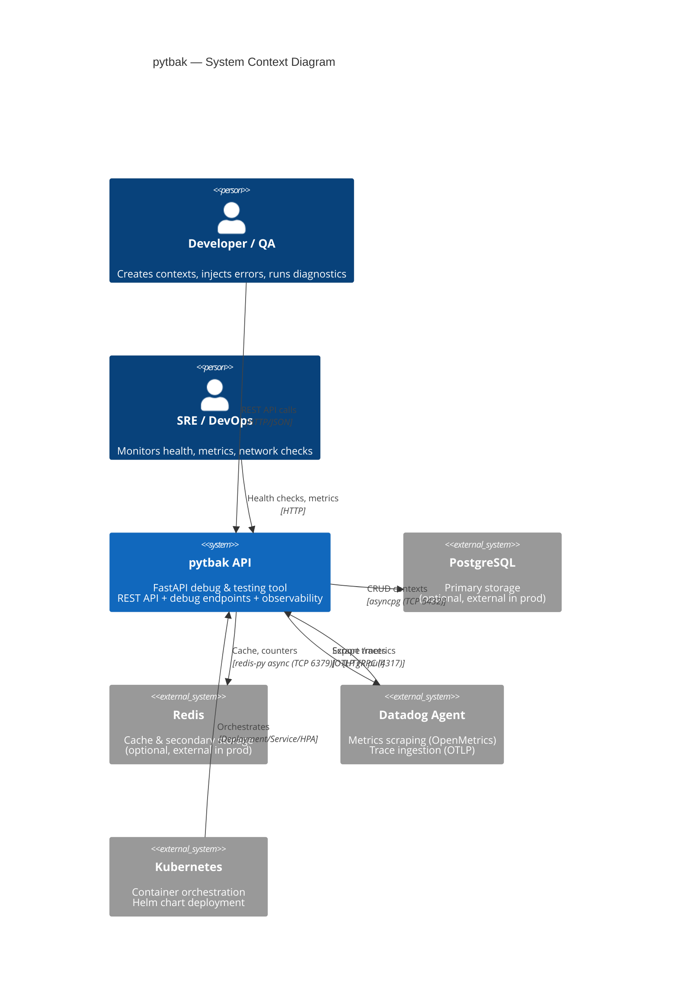

# 1. Overview & C4 Context (Level 1)

## 1.1 System Purpose

**pytbak** is a production-ready FastAPI debug API designed as a Swiss Army knife for API stress testing, network diagnostics, and observability demos.

| Attribute | Value |
|-----------|-------|
| **Name** | pytbak (Python Test Backend) |
| **Type** | Debug & Testing API Tool |
| **Framework** | FastAPI 0.115+ (Python 3.11+) |
| **Version** | 2.0.0 (migrated from Flask v1) |
| **Repository** | [github.com/lorenzogirardi/flask-test-api](https://github.com/lorenzogirardi/flask-test-api) |

## 1.2 Users & Actors

| Actor | Role | Access |
|-------|------|--------|
| **Developer** | Creates/tests contexts, uses debug tools | Full API access |
| **QA/Tester** | Injects errors, delays, CPU load | Full API access |
| **SRE/DevOps** | Monitors health, metrics, network diagnostics | `/mgmt`, `/metrics`, `/debug` |
| **CI/CD Pipeline** | Automated integration tests | `/api`, `/mgmt/health` |
| **Datadog Agent** | Scrapes metrics, receives traces | `/metrics` (OpenMetrics), OTLP port 4317 |

## 1.3 System Boundaries

> **Important**: pytbak is a **debug/testing tool**. It is NOT designed to store production user data.
> All data is ephemeral (in-memory fallback) or stored in dev-grade backends.

| Boundary | In Scope | Out of Scope |
|----------|----------|------------|
| Data | Test contexts, counters, diagnostics | PII, financial data, production workloads |
| Network | Internal cluster, dev environments | Public internet exposure (without gateway) |
| Auth | HTTP Basic Auth on `/debug` endpoints | OAuth2, OIDC, mTLS |
| Compliance | Dev/staging environments | PCI-DSS Zone 1, GDPR data processing |

## 1.4 C4 Context Diagram (Level 1)

## 1.5 Key Capabilities

| Capability | Description | Config |
|------------|-------------|--------|
| **CRUD API** | Context management (create/read/update/delete) | Always on |
| **Error Injection** | `?inject_error=500\|429\|custom:msg` on any endpoint | Query param |
| **Delay Injection** | `?delay_ms=N\|random` on any endpoint | Query param |
| **CPU Spike** | `POST /debug/cpu/spike` with duration/cores | Auth required |
| **Network Scan** | Ping, DNS, TCP check, traceroute | Auth required |
| **Prometheus Metrics** | `/metrics` endpoint, auto-instrumented | `PROMETHEUS_ENABLED` |
| **OTEL Traces** | Full request tracing, exported via OTLP | `OTEL_ENABLED` |
| **Graceful Fallback** | PG → Redis → In-Memory (zero-downtime) | Automatic |

## 1.6 Key Metrics

| Metric | Source | Purpose |
|--------|--------|---------|
| Request latency (p50/p95/p99) | Prometheus `/metrics` | Performance baseline |
| Error rate by status code | Prometheus `/metrics` | Reliability |
| Active connections | Prometheus `/metrics` | Load |
| Storage backend status | `/mgmt/health` | Availability |
| Injected error count | Prometheus `/metrics` | Debug session tracking |
| CPU spike duration/cores | Application logs | Resource impact |

<!-- pr-checks validation: temporary, removed after the gate is verified -->
