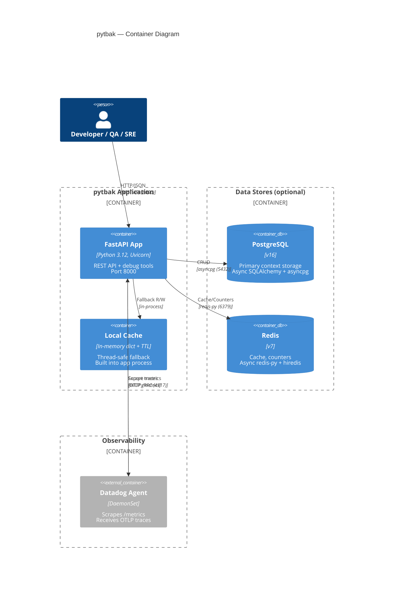

# 2. C4 Containers (Level 2)

## 2.1 Container Overview

| Container | Technology | Purpose | Required |
|-----------|-----------|---------|----------|
| **pytbak API** | FastAPI + Uvicorn | Main application, all endpoints | Yes |
| **PostgreSQL** | PostgreSQL 16 | Primary persistent storage | Optional |
| **Redis** | Redis 7 | Cache, counters, secondary storage | Optional |
| **Datadog Agent** | Datadog | Metrics scraping + trace ingestion | Optional |
| **Local Fallback** | In-memory dict + TTL cache | Zero-dependency storage | Built-in |

## 2.2 Fallback Strategy

```
Priority:  PostgreSQL  →  Redis  →  In-Memory
              ▲              ▲           ▲
          DATABASE_URL    REDIS_URL    always on
          (env var)       (env var)
```

- If `DATABASE_URL` is set and reachable → PostgreSQL is primary store
- If `REDIS_URL` is set and reachable → Redis is secondary/cache
- If both are down or unconfigured → In-memory dict (thread-safe, TTL cache)
- **No startup failure**: app always starts, degrades gracefully

## 2.3 Environment Differences

| Aspect | Development | izanami (192.168.1.14) | itachi (prod) | milano (192.168.100.103) |
|--------|-------------|------------------------|---------------|--------------------------|
| PostgreSQL | docker-compose container | Helm chart `helm-postgresql` ns `postgresql` | External managed service | Helm chart `helm-postgresql` ns `postgresql` |
| Redis | docker-compose container | Helm chart `helm-redis` ns `redis` | External managed service | Helm chart `helm-redis` ns `redis` |
| Webdis | Not used | Deployed (`:7379` HTTP interface) | Not used | Deployed (`:7379` HTTP interface) |
| Observability | Libraries only | Datadog Agent in cluster | Datadog Agent in cluster | Datadog Agent (Operator) in cluster |
| Config | `.env` file | `values-izanami.yaml` + K8s secrets | `values-itachi.yaml` + K8s secrets | `values-milano.yaml` + K8s secrets |
| Scaling | Single instance | 1 replica, no HPA | HPA (2-10 replicas) | 1 replica, no HPA |
| Storage | In-memory/local | hostPath PV (Retain) `/mnt/` | Managed storage | local-path PV (k3s default) |
| Ingress | Not used | nginx (`public`) via apacherr proxy | Kong | Traefik (k3s built-in) |
| Public URL | localhost:8000 | https://services.k8s.it/api/ | Via Kong gateway | https://milano.k8s.it/ |
| Access | Local | Direct / Cloudflare tunnel | Direct | SSH tunnel → `milano.freemyip.com:55022` |

## 2.4 C4 Container Diagram (Level 2)



## 2.5 Container Communication Matrix

| From | To | Protocol | Port | Auth | Encryption | Async |
|------|-----|----------|------|------|-----------|-------|
| User | pytbak API | HTTP | 8000 | Basic (debug only) | TLS at ingress | - |
| pytbak API | PostgreSQL | TCP | 5432 | Password | SSL optional | Yes (asyncpg) |
| pytbak API | Redis | TCP | 6379 | None (internal) | TLS optional | Yes (aioredis) |
| pytbak API | Datadog Agent | gRPC | 4317 | None (internal) | No | Yes (batch export) |
| Datadog Agent | pytbak API | HTTP | 8000 | None | No | Pull-based |

## 2.6 Port Map

| Port | Service | Protocol | Exposure |
|------|---------|----------|----------|
| 8000 | FastAPI (Uvicorn) | HTTP | ClusterIP / Ingress |
| 5432 | PostgreSQL | TCP | Internal only (ns: postgresql) |
| 6379 | Redis | TCP | Internal only (ns: redis) |
| 7379 | Webdis HTTP | HTTP | Internal only (ns: redis) |
| 4317 | OTLP gRPC (Datadog) | gRPC | Internal only |
