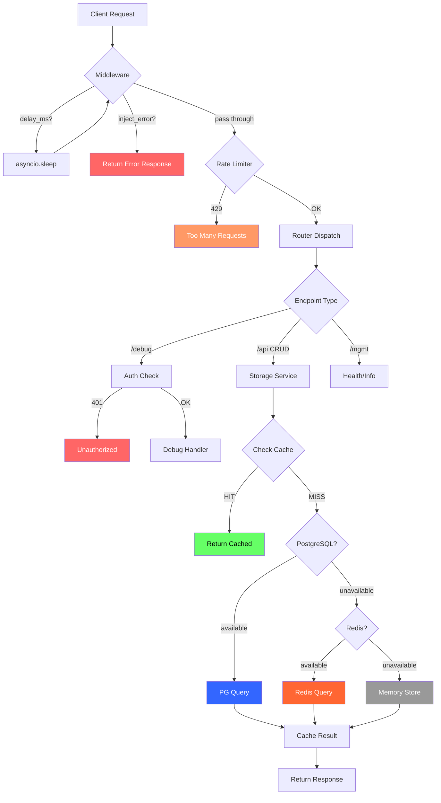

# 5. Enterprise Architecture

## 5.1 Deployment Models

### Development (docker-compose)

```
┌─────────────────────────────────────────┐
│           Docker Compose (local)        │
│                                         │
│  ┌──────────┐  ┌─────────┐  ┌───────┐  │
│  │ pytbak   │  │PostgreSQL│  │ Redis │  │
│  │ :8000    │→ │ :5432    │  │ :6379 │  │
│  └──────────┘  └─────────┘  └───────┘  │
│       ↑                                 │
│    localhost                            │
└─────────────────────────────────────────┘
```

- 3 containers: web, postgres, redis
- Observability: libraries in-app (no sidecar containers)
- Config: `.env` file

### Production (Kubernetes + Helm)

```
┌──────────────────────────────────────────────────────────┐
│                    Kubernetes Cluster                     │
│                                                          │
│  ┌─────────────────────────────────┐   ┌──────────────┐  │
│  │  pytbak Deployment (HPA 2-10)  │   │ Datadog Agent │  │
│  │  ┌────────┐  ┌────────┐       │   │  (DaemonSet)  │  │
│  │  │ Pod 1  │  │ Pod 2  │  ...  │   │               │  │
│  │  │ :8000  │  │ :8000  │       │   │  scrape       │  │
│  │  └────────┘  └────────┘       │   │  /metrics     │  │
│  │       ↕ Service (ClusterIP)    │   │  receive OTLP │  │
│  └─────────────────────────────────┘   └──────────────┘  │
│       │                    │                              │
│  ┌────▼────┐         ┌────▼────┐                         │
│  │ Ingress │         │  HPA    │                         │
│  │ (HTTPS) │         │ CPU 70% │                         │
│  └─────────┘         └─────────┘                         │
└──────────────────────────────────────────────────────────┘
         │                           │
    ┌────▼──────────┐    ┌──────────▼────────┐
    │ External PG   │    │  External Redis   │
    │ (RDS/CloudSQL)│    │ (ElastiCache/     │
    │               │    │  Memorystore)     │
    └───────────────┘    └───────────────────┘
```

## 5.2 Kubernetes Resources (Helm Chart)

| Resource | Name | Config |
|----------|------|--------|
| Deployment | `pytbak` | 2-10 replicas via HPA |
| Service | `pytbak` | ClusterIP:8000 |
| Ingress | `pytbak` | Optional, TLS termination |
| HPA | `pytbak` | Target CPU 70% |
| ConfigMap | `pytbak-config` | Non-sensitive env vars |
| Secret | `pytbak-auth` | DIAG_USERNAME, DIAG_PASSWORD |
| ServiceMonitor | `pytbak` | Optional, for Prometheus Operator |

## 5.3 Scaling Strategy

| Dimension | Strategy | Config |
|-----------|----------|--------|
| **Horizontal** | HPA based on CPU utilization | min=2, max=10, target=70% |
| **Vertical** | Resource requests/limits | 100m-500m CPU, 128Mi-256Mi RAM |
| **Database** | Connection pooling (SQLAlchemy pool_pre_ping) | External PG handles scaling |
| **Redis** | Single connection per pod (async) | External Redis handles scaling |
| **Cache** | Per-pod in-memory TTL cache | 1000 items, 300s TTL |

## 5.4 Data Flow Diagram



## 5.5 Monitoring

### Prometheus Metrics (auto-instrumented)

| Metric | Type | Description |
|--------|------|-------------|
| `http_requests_total` | Counter | Total requests by method, endpoint, status |
| `http_request_duration_seconds` | Histogram | Request latency distribution |
| `http_requests_in_progress` | Gauge | Currently processing requests |
| `python_gc_*` | Counter/Gauge | Python GC stats |

### Sample PromQL Queries

```promql
# Request rate (last 5m)
rate(http_requests_total{service="pytbak"}[5m])

# p95 latency
histogram_quantile(0.95, rate(http_request_duration_seconds_bucket{service="pytbak"}[5m]))

# Error rate (5xx)
sum(rate(http_requests_total{service="pytbak", status=~"5.."}[5m]))
/ sum(rate(http_requests_total{service="pytbak"}[5m]))

# Injected errors (custom label if using middleware counter)
rate(http_requests_total{service="pytbak", handler="/mgmt/info", status="500"}[5m])
```

### OTEL Traces

| Attribute | Value |
|-----------|-------|
| `service.name` | pytbak (configurable) |
| `http.method` | GET, POST, PUT, DELETE |
| `http.route` | /api/contexts/{context_id} |
| `http.status_code` | 200, 404, 500, ... |
| `http.target` | Full URL path |
| Export | OTLP gRPC → Datadog Agent (port 4317) |

### Datadog Integration

```yaml
# Helm deployment annotations (auto-configured)
ad.datadoghq.com/pytbak.checks: |
  {
    "openmetrics": {
      "instances": [{
        "openmetrics_endpoint": "http://%%host%%:8000/metrics",
        "namespace": "pytbak",
        "metrics": [".*"]
      }]
    }
  }
```

## 5.6 Disaster Recovery

| Scenario | Impact | Recovery |
|----------|--------|----------|
| PostgreSQL down | CRUD degrades to Redis/memory | Automatic fallback, zero downtime |
| Redis down | Cache miss, counters unavailable | Automatic fallback to memory |
| Both PG + Redis down | Full in-memory mode | Data ephemeral until backends recover |
| Pod crash | 1/N capacity loss | HPA maintains min replicas, K8s restarts |
| Full cluster failure | Service unavailable | Helm re-deploy, data in external PG/Redis |
