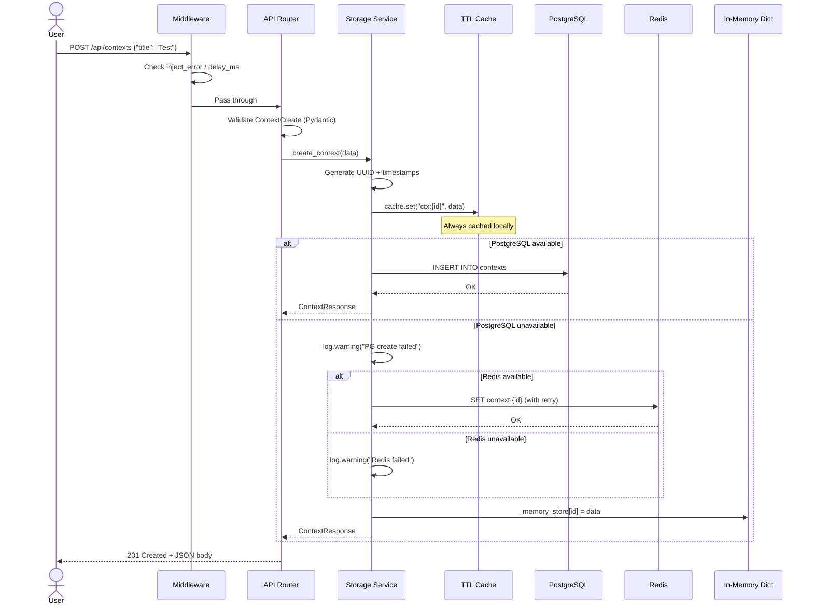
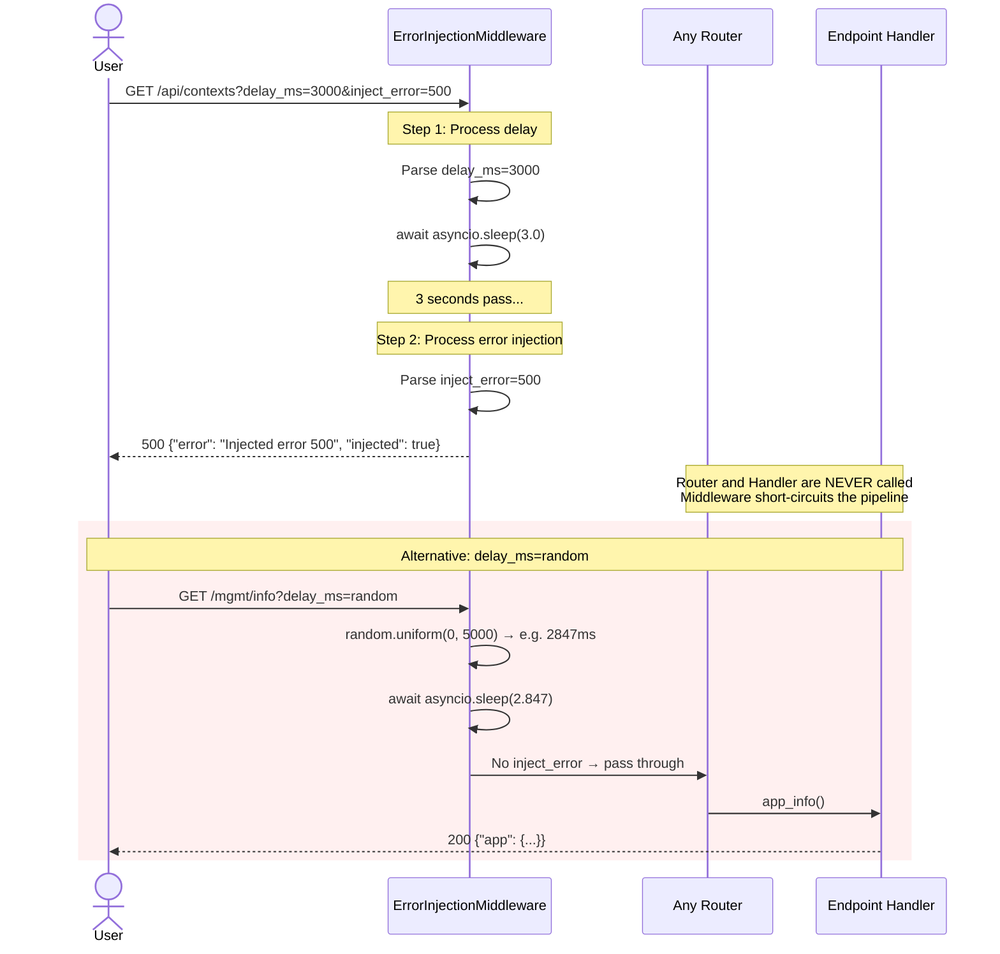
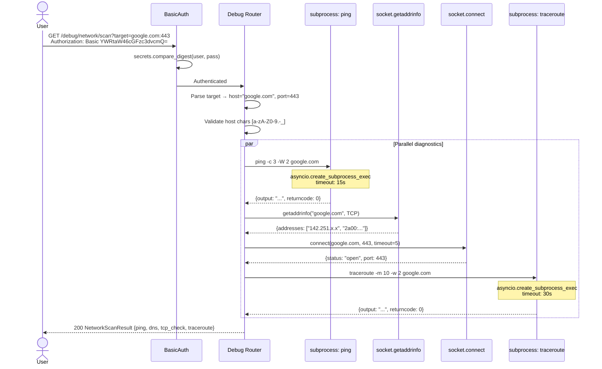
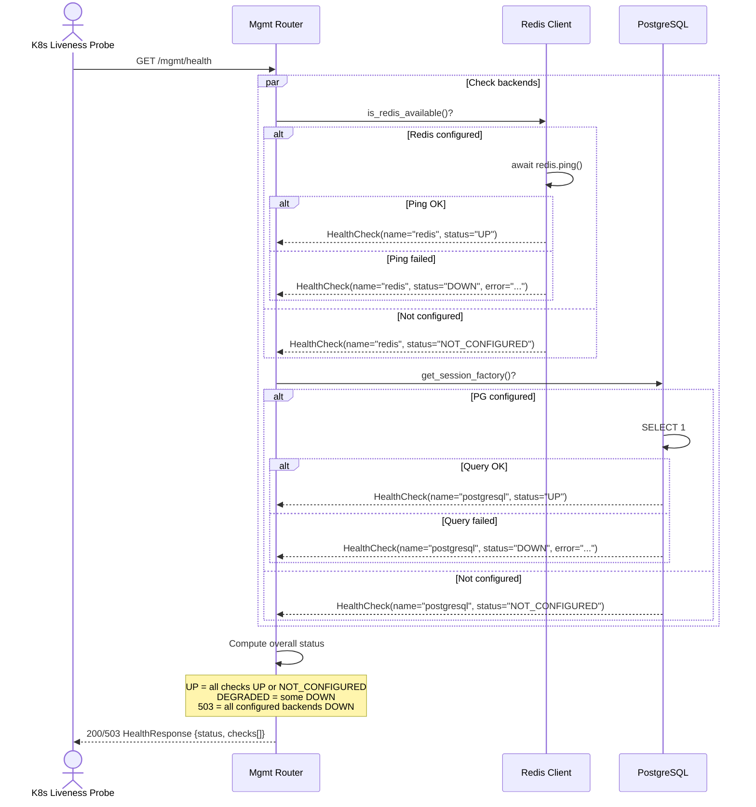
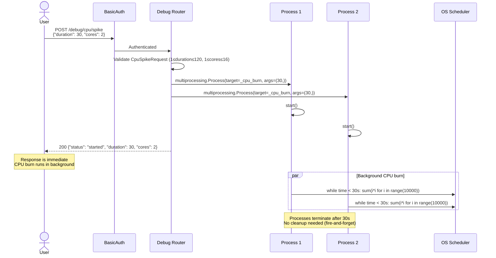

# 7. Sequence Diagrams

## 7.1 Happy Path — POST /api/contexts (with fallback)

## 7.2 Error Injection + Delay

## 7.3 Network Scan (/debug/network/scan)

## 7.4 Health Check Flow

## 7.5 CPU Spike Flow

