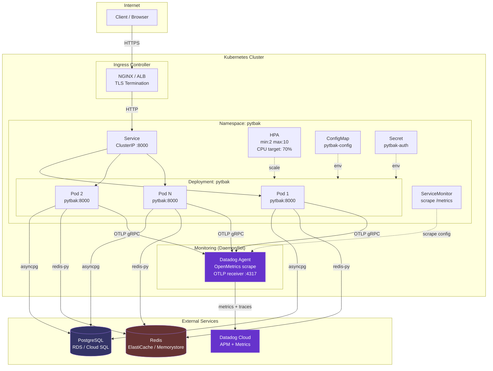
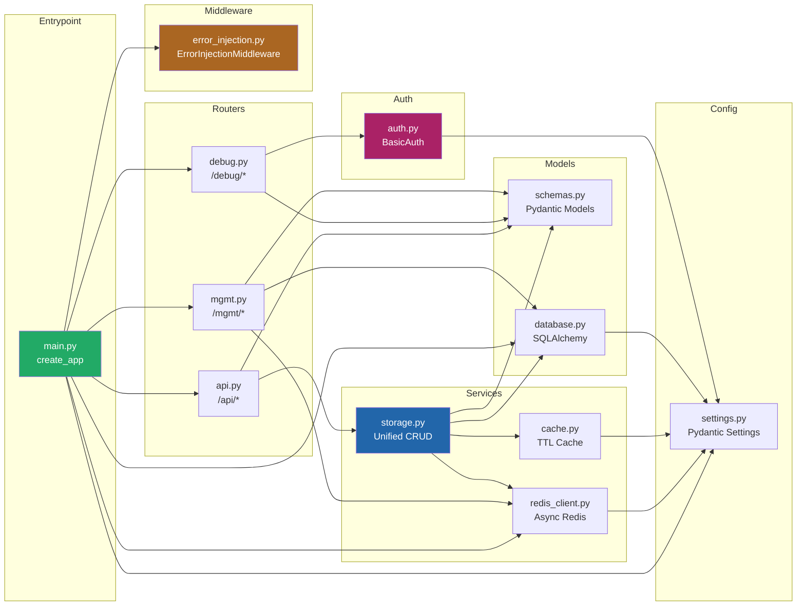
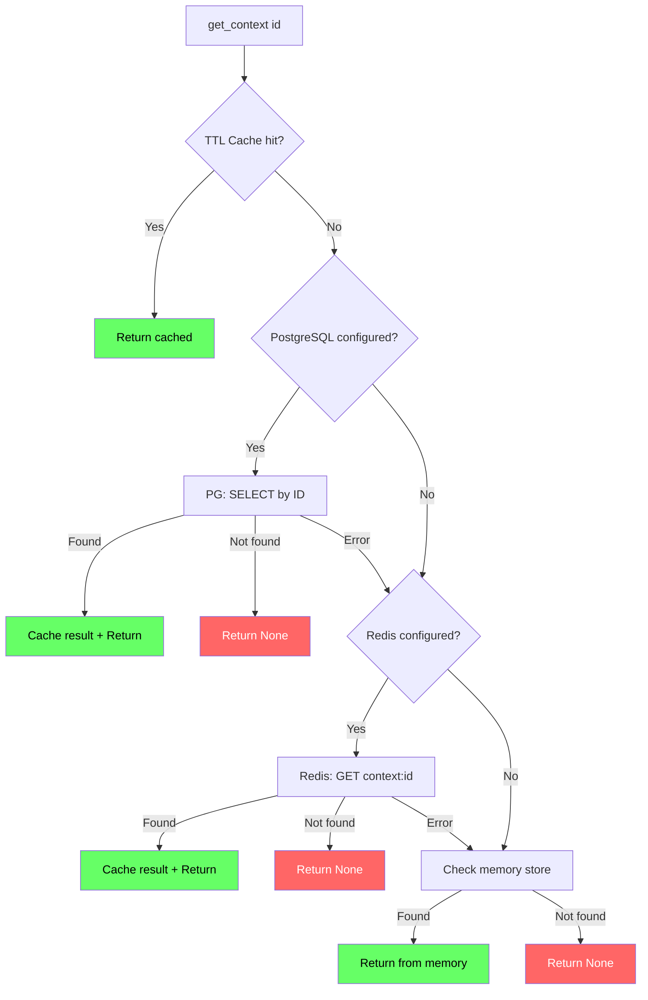
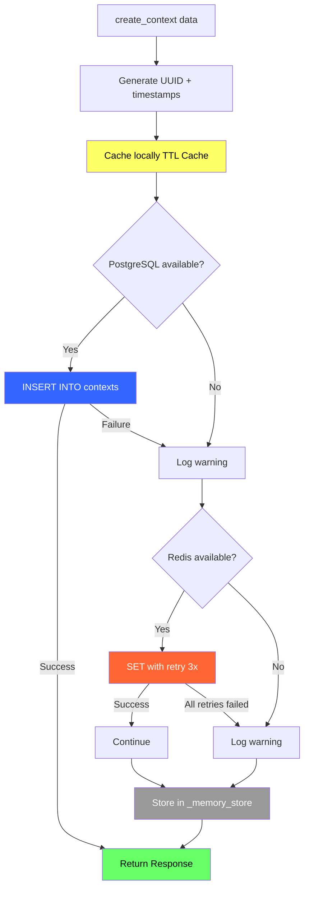

# 8. Diagrams & Graphs

## 8.1 Kubernetes Deployment Diagram



## 8.2 Component Dependency Graph



## 8.3 Storage Read Flow



## 8.4 Storage Write Flow



## 8.5 Application Startup Flow

```mermaid
flowchart TD
    A[uvicorn app.main:app] --> B[create_app]
    B --> C[Load Settings .env]
    C --> D[Register Middleware]
    D --> D1[GZipMiddleware]
    D --> D2[ErrorInjectionMiddleware]
    D --> D3[slowapi RateLimiter]

    D --> E{PROMETHEUS_ENABLED?}
    E -->|Yes| F[Instrumentator.expose /metrics]
    E -->|No| G[Skip]

    D --> H{OTEL_ENABLED?}
    H -->|Yes| I[TracerProvider + BatchSpanProcessor<br/>FastAPIInstrumentor]
    H -->|No| J[Skip]

    D --> K[Register Routers]
    K --> K1[/api]
    K --> K2[/debug]
    K --> K3[/mgmt]

    B --> L[Lifespan: startup]
    L --> M[init_db]
    M -->|DATABASE_URL set| N[Create engine + tables]
    M -->|Not set| O[PG disabled]
    L --> P[init_redis]
    P -->|REDIS_URL set| Q[Connect + ping]
    P -->|Not set| R[Redis disabled]

    N & O & Q & R --> S[App Ready]
    S --> T[Serving on :8000]

    style T fill:#6f6,color:#000
    style O fill:#999,color:#fff
    style R fill:#999,color:#fff
```

## 8.6 Request Lifecycle


