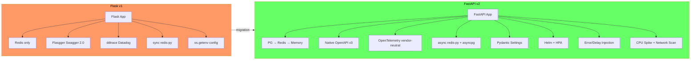

# 9. ADR-001: Migration from Flask to FastAPI

## Metadata

| Field | Value |
|-------|-------|
| **ADR ID** | ADR-001 |
| **Title** | Migrate pytbak from Flask to FastAPI |
| **Status** | Accepted |
| **Date** | 2026-02-22 |
| **Author** | Lorenzo Girardi |
| **Reviewers** | Architecture Team |
| **Branch** | `feat/fastapi-rewrite` |

## Context

The pytbak application was originally built with Flask as a simple debug/testing API. Over time, requirements grew to include:

1. **Async I/O** — Redis and PostgreSQL operations should be non-blocking
2. **Native OpenAPI v3** — Flasgger (Swagger 2.0) was limited and required manual YAML specs
3. **Type-safe validation** — Manual `request.json` parsing was error-prone
4. **Modern observability** — Migration from Datadog-specific (ddtrace) to vendor-neutral (OpenTelemetry)
5. **Graceful degradation** — App should work without any external dependencies
6. **Production-ready deployment** — Helm chart, HPA, health probes

## Decision

**Rewrite the application from Flask to FastAPI**, preserving all existing endpoints and behavior while adding new capabilities.

### Alternatives Considered

| Option | Pros | Cons | Decision |
|--------|------|------|----------|
| **Keep Flask + add async** | Minimal changes | Flask async is bolt-on; Flasgger maintenance burden | Rejected |
| **Flask → Django REST** | Mature ecosystem | Overkill for debug tool; heavy ORM | Rejected |
| **Flask → FastAPI** | Native async, Pydantic, OpenAPI v3, modern | Full rewrite required | **Accepted** |
| **Flask → Litestar** | Similar to FastAPI, good perf | Smaller community, less adoption | Rejected |

### Key Factors

1. **FastAPI native OpenAPI v3**: Swagger UI and ReDoc built-in, zero config
2. **Pydantic v2**: Request validation, settings management, serialization — all in one
3. **async/await native**: asyncpg + aioredis work naturally
4. **Dependency injection**: Clean auth, config, and service injection
5. **Community & ecosystem**: Largest modern Python API framework

## Consequences

### Positive

| Consequence | Impact |
|-------------|--------|
| Native OpenAPI v3 with Swagger UI + ReDoc | Zero-effort API documentation |
| Pydantic models for all I/O | Type-safe, auto-validated, documented |
| True async I/O | Better throughput under concurrent load |
| Vendor-neutral observability (OTEL) | No Datadog lock-in |
| Graceful fallback chain (PG→Redis→Memory) | Zero-dependency startup |
| Helm chart for K8s deployment | Production-ready infrastructure |
| 37 automated tests | Regression safety |

### Negative

| Consequence | Mitigation |
|-------------|-----------|
| Full rewrite (not incremental migration) | All original endpoints preserved and tested |
| New dependency set (FastAPI ecosystem) | Well-maintained, actively developed |
| Team needs to learn FastAPI patterns | Comprehensive documentation (this ADR + docs/) |
| Legacy Flask code still in `docker/` | Preserved for reference, can be removed later |

### Neutral

| Consequence | Notes |
|-------------|-------|
| Port change 5000 → 8000 | FastAPI/Uvicorn convention |
| Debug endpoints moved `/api/ping` → `/debug/ping` | Better REST structure |
| Datadog ddtrace → OpenTelemetry | Datadog Agent receives OTLP natively |

## Migration Map

| Flask v1 | FastAPI v2 | Notes |
|----------|-----------|-------|
| `Flask(__name__)` | `FastAPI()` via `create_app()` | Factory pattern |
| `@app.route()` | `APIRouter` with prefix | Modular routers |
| `request.json` | Pydantic model parameter | Auto-validated |
| `make_response(jsonify(...), 201)` | `response_model` + `status_code` | Declarative |
| `flask-compress` | `GZipMiddleware` | Built-in |
| `prometheus-flask-exporter` | `prometheus-fastapi-instrumentator` | Same metrics |
| `ddtrace` | `opentelemetry-instrumentation-fastapi` | Vendor-neutral |
| `flasgger` (Swagger 2.0) | Native OpenAPI v3 (`/docs`, `/redoc`) | Built-in |
| `redis.Redis` (sync) | `redis.asyncio` | Async |
| `os.getenv()` | `pydantic_settings.BaseSettings` | Typed, validated |
| `@requires_auth` decorator | `Depends(verify_credentials)` | DI pattern |
| Manual error handlers | `@app.exception_handler()` | Consistent |
| `gunicorn + Flask` | `uvicorn + FastAPI` | ASGI |

## Architecture Comparison

## Validation

| Criteria | Flask v1 | FastAPI v2 | Status |
|----------|----------|------------|--------|
| All original endpoints work | Baseline | 37 tests passing | Verified |
| Docker build | Flask image | python:3.12-slim | Verified |
| Health check | `/mgmt/health` | `/mgmt/health` (PG+Redis) | Verified |
| Metrics | `/metrics` | `/metrics` (auto-instrumented) | Verified |
| API docs | `/api/apidocs/` (Flasgger) | `/docs` + `/redoc` (native) | Verified |
| Auth | Basic Auth on diag | Basic Auth on `/debug/*` | Verified |
| Redis operations | Sync | Async with retry + fallback | Verified |
| Error handling | Manual JSON responses | Pydantic + exception handlers | Verified |

## References

- [FastAPI Documentation](https://fastapi.tiangolo.com/)
- [Pydantic v2 Settings](https://docs.pydantic.dev/latest/concepts/pydantic_settings/)
- [OpenTelemetry Python](https://opentelemetry.io/docs/languages/python/)
- [C4 Model](https://c4model.com/)
- Repository: [github.com/lorenzogirardi/flask-test-api](https://github.com/lorenzogirardi/flask-test-api)
