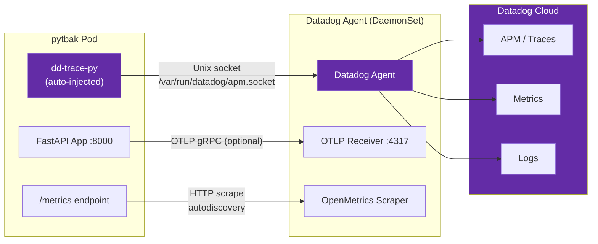

# 10. Datadog Integration

## 10.1 Architecture Overview

pytbak integrates with Datadog through two complementary channels:



## 10.2 Auto-Instrumentation (APM)

### How It Works

The Datadog Admission Controller on the cluster intercepts pod creation and injects:

1. **Init containers** — copy tracing libraries into a shared volume
2. **Environment variables** — configure the tracer (`DD_TRACE_AGENT_URL`, `LD_PRELOAD`, etc.)
3. **Volume mounts** — shared dirs for libraries and Unix sockets

### Configuration: Opt-In per Language

Auto-instrumentation is configured as **opt-in** (not global). To enable it on a deployment, add:

```yaml
spec:
  template:
    metadata:
      labels:
        admission.datadoghq.com/enabled: "true"
      annotations:
        admission.datadoghq.com/<language>-lib.version: "latest"
```

Supported `<language>` values: `python`, `js`, `java`, `dotnet`, `ruby`, `php`.

### pytbak Configuration

pytbak uses **Python-only** instrumentation:

```yaml
labels:
  admission.datadoghq.com/enabled: "true"
annotations:
  admission.datadoghq.com/python-lib.version: "latest"
```

This injects only 2 init containers:

| Init Container | Purpose |
|---|---|
| `datadog-init-apm-inject` | APM launcher (`LD_PRELOAD` wrapper) |
| `datadog-lib-python-init` | Copies `dd-trace-py` library |

### Global vs Opt-In Comparison

| Mode | Init Containers | Injected In | Risk |
|---|---|---|---|
| **Global** (`instrumentation.enabled: true`) | 7 (all languages) | Every pod in every namespace | High — breaks incompatible apps |
| **Opt-in** (label per deployment) | 2 (launcher + target language) | Only labeled deployments | Low — explicit control |

### Disabling for a Deployment

To prevent instrumentation on a specific deployment:

```yaml
labels:
  admission.datadoghq.com/enabled: "false"
```

> **Note**: The `label` is required. The `annotation` alone is not sufficient on all Datadog Operator versions.

## 10.3 Metrics (Prometheus / OpenMetrics)

pytbak exposes Prometheus metrics at `/metrics` via `prometheus-fastapi-instrumentator`.

The Helm deployment includes Datadog autodiscovery annotations:

```yaml
annotations:
  ad.datadoghq.com/pytbak.checks: |
    {
      "openmetrics": {
        "instances": [{
          "openmetrics_endpoint": "http://%%host%%:8000/metrics",
          "namespace": "pytbak",
          "metrics": [".*"]
        }]
      }
    }
```

### Metrics Available

| Metric | Type | Description |
|---|---|---|
| `http_requests_total` | Counter | Total requests by method, endpoint, status |
| `http_request_duration_seconds` | Histogram | Request latency distribution |
| `http_requests_in_progress` | Gauge | Currently processing requests |

## 10.4 Traces (OTLP)

pytbak supports two tracing paths:

| Path | Config | Transport |
|---|---|---|
| **Datadog auto-inject** (default) | `LD_PRELOAD` + `dd-trace-py` | Unix socket `/var/run/datadog/apm.socket` |
| **OpenTelemetry** (optional) | `OTEL_ENABLED=true` | OTLP gRPC → Datadog Agent :4317 |

Both paths send traces to the Datadog Agent, which forwards to Datadog Cloud.

> With auto-instrumentation enabled, OTEL can be disabled (`OTEL_ENABLED=false`) since `dd-trace-py` handles tracing natively.

## 10.5 Environment Variables Injected

When auto-instrumentation is active, Datadog injects these env vars:

| Variable | Value | Purpose |
|---|---|---|
| `DD_TRACE_ENABLED` | `true` | Enable tracing |
| `DD_TRACE_AGENT_URL` | `unix:///var/run/datadog/apm.socket` | Trace transport |
| `DD_DOGSTATSD_URL` | `unix:///var/run/datadog/dsd.socket` | StatsD transport |
| `DD_RUNTIME_METRICS_ENABLED` | `true` | Python runtime metrics |
| `DD_LOGS_INJECTION` | `true` | Inject trace IDs into logs |
| `DD_APPSEC_ENABLED` | `true` | Application Security Monitoring |
| `DD_IAST_ENABLED` | `true` | Interactive Application Security Testing |
| `DD_APPSEC_SCA_ENABLED` | `true` | Software Composition Analysis |
| `LD_PRELOAD` | `/opt/datadog-packages/.../launcher.preload.so` | Process wrapper |

## 10.6 DatadogAgent CRD Configuration

The cluster-level configuration lives in the `DatadogAgent` CRD (`datadog` namespace):

```yaml
apiVersion: datadoghq.com/v2alpha1
kind: DatadogAgent
metadata:
  name: datadog
  namespace: datadog
spec:
  features:
    apm:
      enabled: true
      instrumentation:
        enabled: false  # opt-in mode (not global)
    admissionController:
      enabled: true
    otlp:
      receiver:
        protocols:
          grpc:
            enabled: true
```

Key: `instrumentation.enabled: false` disables global injection. Pods must opt-in via labels.

## 10.7 Troubleshooting

### Pod in CrashLoopBackOff after DD injection

**Symptom**: `Error: Cannot find module '/opt/datadog/apm/library/<lang>/node_modules/dd-trace/init.js'`

**Cause**: Language library init container failed to copy files, or incompatible app runtime.

**Fix**: Add label `admission.datadoghq.com/enabled: "false"` and restart:
```bash
kubectl -n <ns> patch deployment <name> --type merge \
  -p '{"spec":{"template":{"metadata":{"labels":{"admission.datadoghq.com/enabled":"false"}}}}}'
kubectl -n <ns> rollout restart deployment <name>
```

### HPA scaling erratically during rolling updates

**Symptom**: HPA scales to max replicas when pods are restarting.

**Cause**: Metrics-server returns no data for unready pods → HPA freezes at last known count.

**Fix**: Configure HPA behavior with stabilization windows:
```yaml
behavior:
  scaleUp:
    stabilizationWindowSeconds: 300  # wait 5 min before scaling up
  scaleDown:
    stabilizationWindowSeconds: 60
```

### Startup too slow with DD instrumentation

**Symptom**: Pods killed by startupProbe before app is ready.

**Cause**: `LD_PRELOAD` launcher adds ~15-20s to startup. Combined with backend connection timeouts, total startup can exceed probe limits.

**Fix**: Increase startupProbe tolerance:
```yaml
startupProbe:
  failureThreshold: 20
  periodSeconds: 5  # = 100s total tolerance
```
